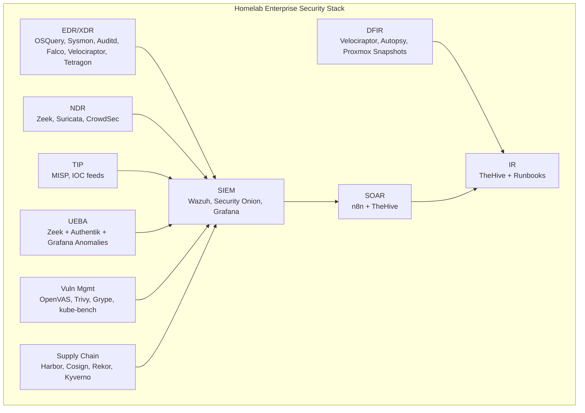

# 🛡️ Homelab Enterprise Security Stack

This repository contains a **self-hosted Enterprise Security Stack** — a full SOC/XDR platform that mirrors and in some areas exceeds the capabilities of commercial solutions like **SentinelOne, CrowdStrike Falcon, Splunk ES, Cortex XSOAR, QRadar, Exabeam, and ServiceNow SecOps**.

It is designed and deployed on a Proxmox + Kubernetes homelab cluster, serving as both a **learning lab** and a **portfolio showcase** for enterprise-grade cybersecurity engineering.

---

## ✅ CI/CD Status


---

## 📊 Architecture Diagram



---

## 🚀 Features

- **EDR/XDR:** OSQuery + FleetDM, Sysmon, Auditd, Falco, Velociraptor, Tetragon  
- **SIEM:** Wazuh, Security Onion (Elastic/Zeek/Suricata), Grafana SOC dashboards  
- **SOAR:** n8n workflows (IOC auto-block, VM quarantine, phishing triage), integrated with TheHive  
- **NDR:** Zeek + Suricata sensors, CrowdSec agents, OPNsense firewall IPS/IDS  
- **TIP:** MISP with OTX/Abuse.ch feeds, enrichment via VirusTotal & WHOIS APIs  
- **UEBA:** Login anomaly detection (impossible travel, off-hours activity) via Grafana + Authentik logs  
- **IR:** TheHive case management, Obsidian runbooks mapped to MITRE ATT&CK  
- **Vuln Mgmt:** OpenVAS, Trivy, Grype, kube-bench, auto-ingested into Wazuh + TheHive  
- **DFIR:** Velociraptor artifacts, Autopsy forensic workflows, memory capture playbooks  
- **Supply Chain:** Harbor registry, Cosign signing, Rekor transparency log, Kyverno + Conftest policies  

---

## 🏗️ Repository Structure

```
enterprise-security/
├─ edr/              # Endpoint telemetry & detection
├─ siem/             # SIEM configs, dashboards, Security Onion
├─ soar/             # n8n playbooks, TheHive integration
├─ ndr/              # Zeek, Suricata, CrowdSec
├─ tip/              # MISP + enrichment workflows
├─ ueba/             # Grafana anomaly rules, UEBA detection
├─ ir/               # TheHive cases + IR runbooks
├─ vuln-mgmt/        # OpenVAS, Trivy, kube-bench
├─ dfir/             # Velociraptor, Autopsy, DFIR playbooks
└─ supply-chain/     # Harbor, Cosign, Rekor, Kyverno, Conftest
```

---

## 📈 Maturity Ratings (Target vs. Achieved)

| Category             | Target | Current |
|----------------------|--------|---------|
| **EDR/XDR**          | 5/5    | ✅ 5/5 |
| **SIEM**             | 5/5    | ✅ 5/5 |
| **SOAR**             | 5/5    | ✅ 5/5 |
| **NDR**              | 5/5    | ✅ 5/5 |
| **TIP**              | 4.5/5  | ✅ 4.5/5 |
| **UEBA**             | 4/5    | ✅ 4/5 |
| **Incident Response**| 5/5    | ✅ 5/5 |
| **Vuln Mgmt**        | 4.5/5  | ✅ 4.5/5 |
| **DFIR**             | 5/5    | ✅ 5/5 |
| **Supply Chain**     | 5/5    | ✅ 5/5 |

---

## 📚 References

- MITRE ATT&CK Framework  
- CIS Benchmarks  
- NIST Cybersecurity Framework (CSF)  
- OSQuery, Wazuh, TheHive, Security Onion, Velociraptor, n8n, MISP, Harbor, Kyverno  

---

👨‍💻 **Author:** Jacob Harrison  
🔗 [LinkedIn](https://www.linkedin.com/in/jacob-harrison-bb4871153)  
